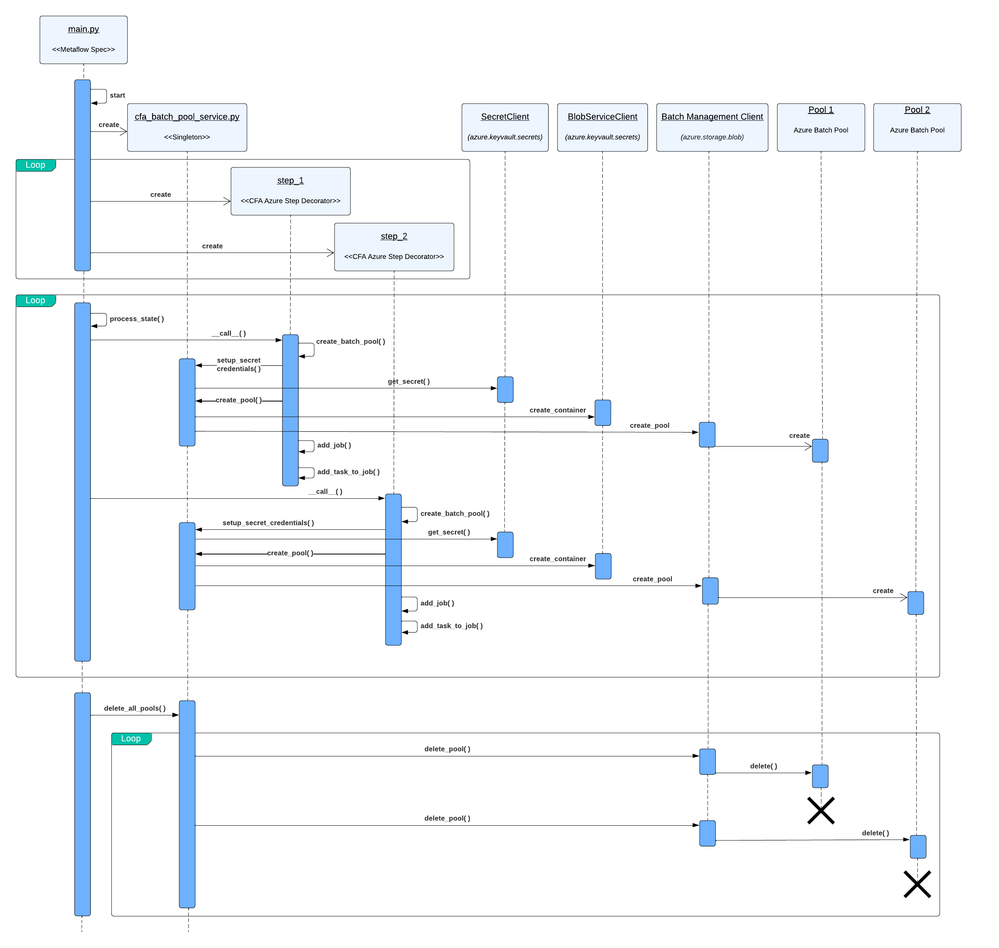

# Run a hybrid Metaflow job 
## Created by Fawad Rafi (Peraton) for CFA

# Outline
Metaflow is an open-source job orchestration framework that can run tasks locally or remotely in the Cloud as part of a job. 
Each job is defined as a class that inherits from the FlowSpec class and overrides its methods. Tasks within a job are decorated with @step. By default all tasks run locally but we can also run these in a Kubernetes cluster and AWS Batch. Since Azure Batch is not supported in Metaflow currently, this example illustrates how to use a custom Azure Batch Decorator that can run step within Metaflow job remotely using the Azure Batch service. 

A singleton class CFA Azure Batch Pool Service has been added to the `custom_metaflow` package to encapsulate the API calls needed for creating batch pools and mounting containers. 

Various usages examples are located in the [examples](examples/README.md) subfolder
