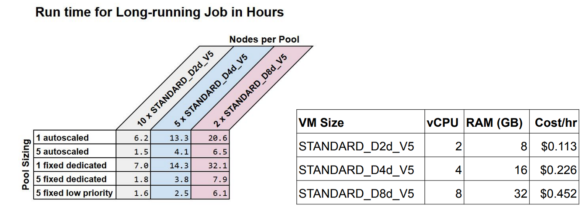
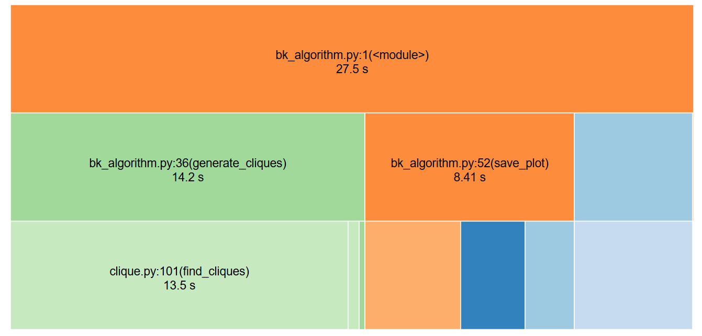
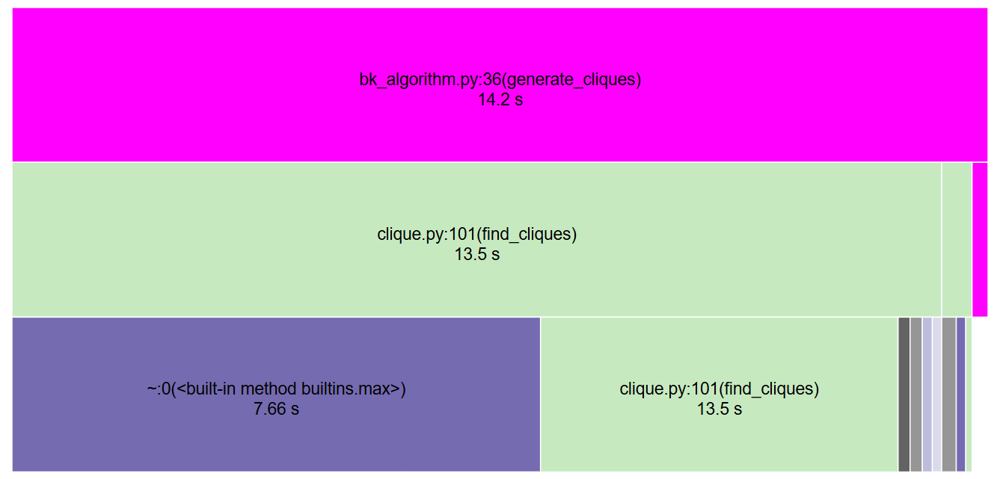
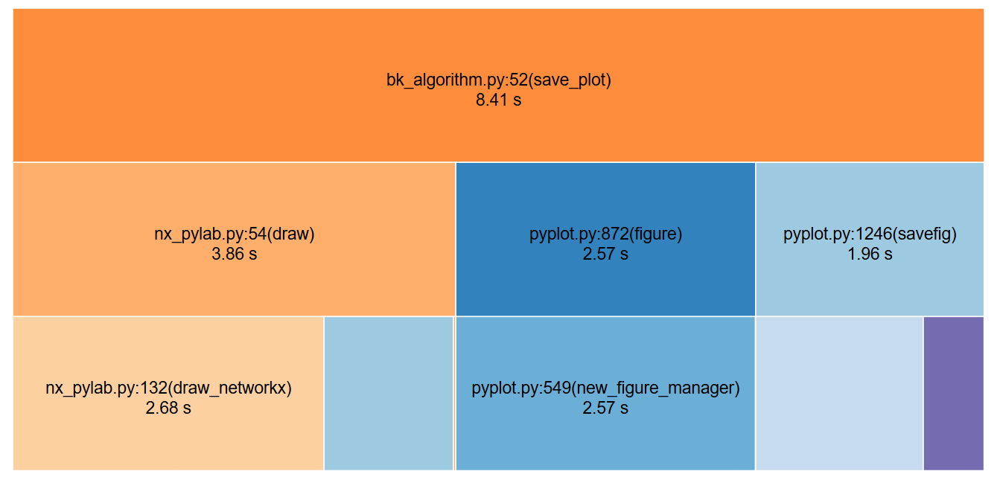
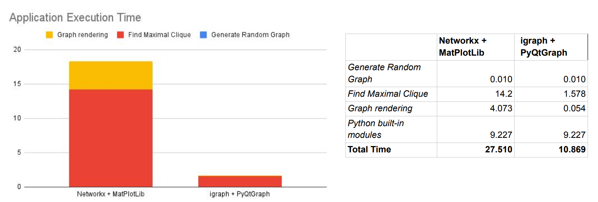

# Run a hybrid Metaflow job
## Created by Fawad Rafi (Peraton) for CFA

# Outline
Metaflow is an open-source job orchestration framework that can run tasks locally or remotely in the Cloud as part of a job.
Each job is defined as a class that inherits from the `FlowSpec` class and overrides its methods. Tasks within a job are decorated with `@step`. By default all tasks run locally but we can also run these in a Kubernetes cluster or AWS Batch. Since Azure Batch is not supported in Metaflow currently, this example illustrates how to use a custom Azure Batch Decorator that can run step within Metaflow job remotely using Azure Batch service.

A singleton class CFA Azure Batch Pool Service has been added to the `custom_metaflow` package to encapsulate the API calls needed for creating batch pools and mounting containers.

Various usages examples are located in the [examples](examples/README.md) subfolder

# Long Running Jobs

Metaflow scales superbly for long-running jobs that can be containerized and launched as Azure batch jobs.
A long-running job can be characterized as follows:

* It has a runtime of 4 hours or longer
* It can be partitioned into smaller jobs that are independent and can be run concurrently

Computing maximal-cliques in a multiple graph is one example of a long-running job. A clique is a subgraph of interconnected vertices. Finding all cliques within a large graph is an NP-complete problem because it involves building traversal of all edges between all vertices of the graph to discover cliques. One of the most efficient algorithms for finding cliques is [Bron-Kerbosch](https://rosettacode.org/wiki/Bron%E2%80%93Kerbosch_algorithm) that uses recursive backtracking to compute all cliques and sort these by number of vertices to find the largest clique.

## Benchmarking

A series of experiments were performed as part of [benchmarking exercise](https://github.com/CDCgov/cfa-cloudops/issues/18) with the following objectives:

1. Determine whether Metaflow performs better with autoscaled Azure pools or fixed-scale pools
2. With fixed-scale pools, does it perform better with dedicated nodes or low-priority nodes?
3. What is the ideal size for virtual machines (nodes) within a pool?
4. What Python application stack is better suited for graph computations? The application stack is specific to the type of long-running job being run.

## Benchmarking Setup

To answer the questions listed in previous section, a Metaflow spec with 50 large graphs was created. Each graph has the following properties:

* Random number of vertices between 2000 and 3000
* Random edge probability (0.01 to 0.99%) between adjacent vertices

The Bron-Kerbosch algorithm was implemented in Python and dockerized into a container image using the [BKDockerfile](examples/BKDockerfile). The container accepts number of vertices (nodes) as an argument, generates a random graph, computes the maximal clique and uploads the graph to Blob storage. It also creates a runtime profile of the Python code using **cProfile** library and uploads it to Blob storage. The Docker image was uploaded to the following Azure container registry: *cfaprdbatchcr.azurecr.io/cfa-metaflow:latest*

The flow spec was launched with different combinations of the following parameters:

* Parallel pool limit: 1 or 5
* Autoscaling: True or False
* Task per node: 1
* Max Autoscale Nodes: 2, 5 or 10
* Number of dedicated and low-priority nodes: 2, 5 or 10
* VM size: STANDARD_D2d_V5, STANDARD_D4d_V5 or STANDARD_D8d_V5

## Findings

15 different configurations were used for this benchmarking exercise:

* Process the 50 graphs in 1 *autoscaled* pool with up to 10 STANDARD_D2d_V5 nodes
* Process the 50 graphs in 1 *fixed-scale* pool with 10 *dedicated* STANDARD_D2d_V5 nodes
* Distribute the 50 graphs across 5 *autoscaled* pools with up to 10 STANDARD_D2d_V5 nodes
* Distribute the 50 graphs across 5 *fixed-scale* pools with 10 *dedicated* STANDARD_D2d_V5 nodes
* Distribute the 50 graphs across 5 *fixed-scale* pools with 10 *low-priority*  STANDARD_D2d_V5 nodes
* Repeat these 5 combinations with 5 STANDARD_D4d_V5 nodes
* Repeat these 5 combinations with 2 STANDARD_D8d_V5 nodes

Long-running jobs perform better with a larger number of smaller sized virtual machines.
In this example, the best performance was achieved with 5 autoscaled pools with maximum number of 10 STANDARD_D2d_V5 virtual machines. The performance was similar with fixed-scale pools.

When larger virtual machines with more memory and virtual CPUs were used, the **task_per_node** parameter was a limiting factor. **Azure storage libraries do not support concurrent writes to same Blob storage.**

Application profile computed with cProfile suggested the performance improves more than 50% when networkx and MatPlotLib are replaced with igraph and PyQtGraph respectively for computing cliques and rendering graphs.

*cProfile stack of application runtime*:

## Recommendations

* Append blobs instead of writing blobs. This allows one virtual machine (node) in Azure batch pool to run multiple tasks concurrently. If that is not possible, then set tasks_per_node to 1.
* Create multiple autoscaled pools for long-running jobs.
* Use smaller size virtual machines to optimize cost. STANDARD_D2d_V5 is ideal and provides best combination of compute, memory and cost.
* Set max_autoscaled_nodes to twice the number of pools (i.e. parallel_pool_limit). For example, if 5 pools are being used, then set max_autoscaled_nodes to 10.
