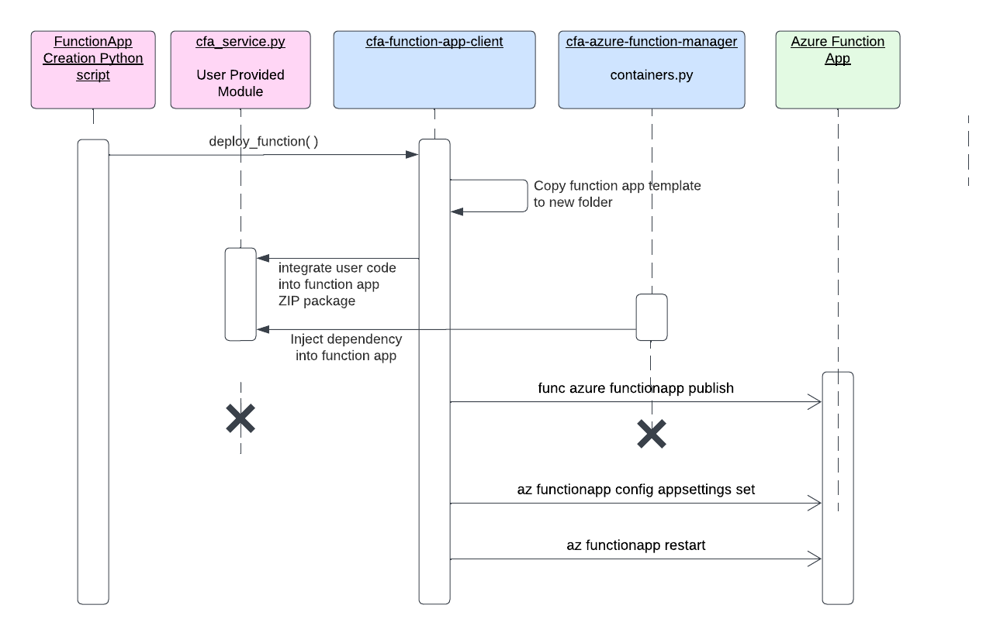

# FunctionAppClient Overview

The `FunctionAppClient` class provides a Python interface for running short-running jobs as serverless Azure Function Apps using the Azure SDK. It supports packaging and deployment of any user-provided Python script, environment variables and package dependencies through dependency injection.

## 1. Features
- Authenticate using Azure Managed Identity and environment variables
- Curate any Python script into a Azure Function App package
- Enable health checks for Azure Function App


## 2. Prerequisites

- Azure subscription with necessary permissions
- Azure CLI installed
- Python 3.9 or higher
- Azure Functions Core Tools 4
- PowerShell for setting environment variables (Windows users)
- Shell for setting environment variables (Linux/macOS users)

### Important Notes
- Additional dependencies can be specified as an optional parameter.
- Custom packages not available on PyPI are not supported.

## 3. Setting Up Environment Variables

### PowerShell Script (Windows) - Option 1

Create a PowerShell script to set the necessary environment variables.

#### `set_environment.ps1`

```powershell
# set_environment.ps1
$env:AZURE_SERVICE_PRINCIPAL_ID = "service-principal-client-id"
$env:AZURE_VAULT = "your-key-vault-name"
$env:AZURE_RESOURCE_GROUP = "your-resource-group"
$env:AZURE_STORAGE_ACCOUNT = "your-storage-account"
$env:AZURE_SUBSCRIPTION_ID = "your-subscription-id"
$env:AZURE_TENANT_ID = "your-tenant-id"
Write-Host "Environment has been set up successfully!"
```
### Running the PowerShell Script
Execute the PowerShell script to set the environment variables and run the Python script.

```powershell
.\set_environment.ps1

```

### Shell Script (Linux/macOS) - Option 2

Create a shell script (`set_environment.sh`) to set the necessary environment variables.

```bash
# set_environment.sh
export AZURE_SERVICE_PRINCIPAL_ID="service-principal-client-id"
export AZURE_VAULT="your-key-vault-name"
export AZURE_RESOURCE_GROUP="your-resource-group"
export AZURE_STORAGE_ACCOUNT="your-storage-account"
export AZURE_SUBSCRIPTION_ID="your-subscription-id"
export AZURE_TENANT_ID="your-tenant-id"
echo "Environment variables have been set successfully!"
```
### Running the Shell Script
Make the script executable and then run it.
```bash
chmod +x set_environment.sh

./set_environment.sh

```
### Environment file - Option 3

Create an environment file set the necessary environment variables.

#### `cfa_cloudops.env`

```
# Authentication info
AZURE_TENANT_ID="REPLACE_WITH_TENANT_ID"
AZURE_SUBSCRIPTION_ID="REPLACE_WITH_SUBSCRIPTION_ID"
AZURE_SP_CLIENT_ID="REPLACE_WITH_SP_CLIENT_ID"
AZURE_KEYVAULT_ENDPOINT="REPLACE_WITH_KEYVAULT_ENDPOINT"
AZURE_KEYVAULT_SP_SECRET_ID="REPLACE_WITH_KEYVAULT_SP_SECRET_ID"

# Azure account info
AZURE_BATCH_ACCOUNT="REPLACE_WITH_BATCH_ACCOUNT"
AZURE_RESOURCE_GROUP="REPLACE_WITH_RESOURCE_GROUP"
AZURE_SUBNET_ID="REPLACE_WITH_SUBNET_ID"
AZURE_USER_ASSIGNED_IDENTITY="REPLACE_WITH_USER_ASSIGNED_IDENTITY"

# Azure Blob storage config
AZURE_BLOB_STORAGE_ACCOUNT="REPLACE_WITH_BLOB_STORAGE_ACCOUNT"

```

Then initialize the `FunctionAppClient` with `dotenv_path` set to environment file.

```python
from cfa.cloudops import FunctionAppClient
func_app_client = FunctionAppClient(
    function_app_name='cfapredictafmprdfunc02',   # Omit this if you want first available function
    dotenv_path='cfa_cloudops.env',
    use_sp=True
)
```

### Azure Key Vault - Option 4

Use secrets stored in Azure Key Vault (e.g. `my-team-vault`).

```python
from cfa.cloudops import FunctionAppClient
func_app_client = FunctionAppClient(keyvault='my-team-vault')
```

## 4. Design/Process Diagram



When the user invokes deploy_function operation, FunctionAppClient first logs into the Azure Portal. It assumes the identity of the service principal configured in environment or key vault.

Next it integrates the user's Python package into a ZIP file that also contains requirements.txt, function app code and dependency injection components. To prepare the code for packaging as ZIP file, FunctionAppClient creates a temporary folder with function name and copies all artifacts to that folder.

The ZIP file is uploaded to the function app that was specified by the user in  `function_app_name` parameter. Otherwise if no function app is specified, FunctionAppClient selects the first available function app from a pool of 10 function apps (cfapredictafmprdfunc01, cfapredictafmprdfunc02, etc) that have already been provisioned for use.

If function_If deployment was successful, FunctionAppClient configures the application settings and health check for function app. Any user-specified environment variables necessary for the user Python package are also applied to the function app.


## 5. Scripts for Testing Function App based on scenario

This section provides example scripts and steps to test the functionality of the FunctionAppClient using different scenarios. Each example is designed to help you understand how to deploy and manage Azure Function Apps with specific use cases. Follow the instructions and examples provided for each scenario.

### Creating and Testing the User Package
In this scenario, you will create a user package that reads from and writes to Azure Blob Storage. The package is then deployed as an Azure Function App using the CFA Azure Function Manager.

#### Ex: User Script (`user_script.py`)
This script reads data from a specified blob in Azure Blob Storage and writes data back to it. It demonstrates basic operations with blob storage and handles exceptions.

```python
# user_user_scriptpackage.py
def main():
    from azure.storage.blob import BlobServiceClient
    try:
        connection_string = "your_blob_storage_connection_string"
        container_name = "your_container_name"
        blob_name = "your_blob_name"

        blob_service_client = BlobServiceClient.from_connection_string(connection_string)
        blob_client = blob_service_client.get_blob_client(container=container_name, blob=blob_name)

        # Write Blob
        data = "Hello, World!"
        blob_client.upload_blob(data, overwrite=True)
        print("Blob written successfully.")

        # Read Blob
        download_stream = blob_client.download_blob()
        content = download_stream.readall()
        print(f"Blob content: {content.decode('utf-8')}")

        return content.decode('utf-8')
    except Exception as e:
        print(f"Error in main function: {str(e)}")
        return f"Error: {str(e)}"

```

#### Testing Script (`test_user_script.py`)
This script demonstrates how to deploy the user package as an Azure Function App, set up the schedule, and manage the function app lifecycle.

```python
# test_user_script.py
import user_script as hw_bs
from cfa.cloudops import FunctionAppClient

func_app_client = FunctionAppClient(
    function_app_name='cfapredictafmprdfunc02', dotenv_path='cfa_cloudops.env', use_sp=True
)

schedule = "* * * * *"  # Run this every minute

func_app_client.deploy_function(schedule, hw_bs.main, dependencies=["azure-storage-blob"])

```
## Blob Storage (Read/Write)

This scenario focuses on reading from and writing to Azure Blob Storage using a sample package and testing its functionality through an Azure Function App.

### Files:
- `blob_storage_pkg.py`
- `test_bs_read_write.py`
- `verify_installation.py`

### Ex: Package with Blob Storage Operations (blob_storage_pkg.py)

This script includes functions to read from and write to Azure Blob Storage and a main function that demonstrates their use.

```python
def main():
    from azure.storage.blob import BlobServiceClient
    try:
        connection_string = "your_blob_storage_connection_string"
        container_name = "your_container_name"
        blob_name = "your_blob_name"

        blob_service_client = BlobServiceClient.from_connection_string(connection_string)
        blob_client = blob_service_client.get_blob_client(container=container_name, blob=blob_name)

        # Write Blob
        data = "Hello, World!"
        blob_client.upload_blob(data, overwrite=True)
        print("Blob written successfully.")

        # Read Blob
        download_stream = blob_client.download_blob()
        content = download_stream.readall()
        print(f"Blob content: {content.decode('utf-8')}")

        return content.decode('utf-8')
    except Exception as e:
        print(f"Error in main function: {str(e)}")
        return f"Error: {str(e)}"

```
#### Testing Script (`test_bs_read_write.py`)

This script demonstrates how to call the main function from the sample package to perform blob storage operations.

```python
# test_bs_read_write.py
import blob_storage_pkg as hw_bs
from cfa.cloudops import FunctionAppClient

func_app_client = FunctionAppClient(
    function_app_name='cfapredictafmprdfunc02', dotenv_path='cfa_cloudops.env', use_sp=True
)

schedule = "* * * * *"  # Run this every minute

# Ensure to pass in the dependencies
func_app_client.deploy_function(schedule, hw_bs.main, dependencies=["azure-storage-blob"])


```

### Using Service Principal
This scenario demonstrates how to deploy a function app using Service Principal authentication. It includes setting up environment variables for the Service Principal and running a sample function that reads from and writes to Azure Blob Storage.

#### Ex: SP with Blob Storage Operations (`sp_blob_storage_pkg.py`)

This script demonstrates how to read from and write to Azure Blob Storage using Service Principal authentication.

```python
# sp_blob_storage_pkg.py
def main():
    from azure.storage.blob import BlobServiceClient
    try:
        connection_string = "your_blob_storage_connection_string"
        container_name = "your_container_name"
        blob_name = "your_blob_name"
        data = "Hello, World!"

        blob_service_client = BlobServiceClient.from_connection_string(connection_string)
        blob_client = blob_service_client.get_blob_client(container=container_name, blob=blob_name)

        # Write Blob
        blob_client.upload_blob(data, overwrite=True)
        print("Blob written successfully.")

        # Read Blob
        download_stream = blob_client.download_blob()
        content = download_stream.readall()
        print(f"Blob content: {content.decode('utf-8')}")

        return content.decode('utf-8')
    except Exception as e:
        print(f"Error in main function: {str(e)}")
        return f"Error: {str(e)}"

```
#### Testing Script (`test_sp_blob_storage_pkg.py`):

This script tests the deployment and execution of a function app using the Service Principal authentication scenario, demonstrating blob read and write operations.

```python
# test_sp_blob_storage_pkg.py
import sp_blob_storage_pkg as sp_pkg
from cfa.cloudops import FunctionAppClient

schedule = "* * * * *"  # Run this every minute

func_app_client = FunctionAppClient(
    function_app_name='cfapredictafmprdfunc02', dotenv_path='cfa_cloudops.env', use_sp=True
)

func_app_client.deploy_function(schedule, sp_pkg.main, dependencies=["azure-storage-blob"], environment_variables=env_vars)

```

### Additional Error Messages
FunctionAppClient performs the following operations when the user invokes the `deploy_function` method:

| Sequence | Operation        | Purpose                                                                                           | Error Log Prefix                                                                           |
|----------|------------------|---------------------------------------------------------------------------------------------------|-------------------------------------------------------------------------------------------|
| 1        | log_into_portal  | Log into Azure portal as service principal                                                       | `FunctionAppClient.log_into_portal(): Error logging into Azure Portal.`                     |
| 2        | publish_function | Create a zip file with Python template and user package. Upload the zip file to function app created in the previous step. | `FunctionAppClient.publish_function(): Error publishing Function App`                       |
| 3        | restart_function | Restart the function app                                                                          | `FunctionAppClient.restart_function(): Error restarting Function App`                       |

All errors and exceptions encountered during deployment shall be written to the console (e.g., Shell, PowerShell). The error log prefix indicates which stage that error occurred in.

For example, login failed with the following error: `AADSTS700082: The refresh token has expired due to inactivity`. This shall be written to the console as follows. This will provide a hint to the developer that the error occurred inside the `log_into_portal` operation.

```plaintext
cfaazurefunction.log_into_portal(): Error logging into Azure Portal. AADSTS700082: The refresh token has expired due to inactivity.
```

In addition the deployment errors encountered during function app creation, there may be runtime errors related to user's Python package. These errors will be written to the
`cfatimer` logs in Azure Function App portal.


Select logs from cfatimer panel:


### Detailed Error Messages

### Login Errors:
- `FunctionAppClient.retrieve_secret()`: Unable to connect to Key Vault: `AZURE_SERVICE_PRINCIPAL_ID` environment variable is missing.
- `FunctionAppClient.retrieve_secret()`: One of these must be provided: `AZURE_SERVICE_PRINCIPAL_SECRET_NAME` or `AZURE_SERVICE_PRINCIPAL_SECRET`
- `FunctionAppClient.log_into_portal()`: Error logging into Azure Portal.

### Health Check Errors:
- `FunctionAppClient.enable_health_check()`: Error updating health check

### App Settings Errors:
- `FunctionAppClient.update_app_settings()`: Error updating app settings for Function App

### Publishing Errors:
- `FunctionAppClient.publish_function()`: Error publishing Function App

### Restart Errors:
- `FunctionAppClient.restart_function()`: Error restarting Function App

### Deployment Errors:

- `FunctionAppClient.deploy_function()`: Deployment aborted due to missing service principal credentials.
- `FunctionAppClient.deploy_function()`: Deployment aborted due to login failure.
- `FunctionAppClient.deploy_function()`: Deployment aborted because no function apps are available.
- `FunctionAppClient.deploy_function()`: Deployment did not complete because Function App publish operation failed.
- `FunctionAppClient.deploy_function()`: Deployment was completed however Function App restart operation failed.

### Permissions Issues
Ensure the Service Principal has the necessary permissions to read from and write to the Azure Blob Storage.
Service Principal also needs the following permissions:
- Create, publish and restart a function app
- Update app settings and general configuration for a function app

After creating the function app, please contact EDAV team and request permissions for your EXT.CDC.GOV account to view logs and app settings of function app. This is necessary for debugging the function app.

### Limitations
- Debugging the function app in Azure requires specific permissions. Currently, debugging is not supported directly. Users may need to work with the EDAV team for additional access if needed.
- Currently the Azure Function Manager can only be invoked from a Linux environment such as Bash shell, Git Bash or Windows Subsystem for Linux. In a future release, support shall be added for Windows Command prompt.

## 6. Scripts for getting metadata about exising Azure Function App

After successfully deploying a function app, you can use one of the following class methods on `FunctionAppClient` to retrieve configuration and runtime details about the function app. All these class methods expect Azure resource group and subscription ID to be provided. There are 2 ways of setting this up:

* set the `AZURE_RESOURCE_GROUP` and `AZURE_SUBSCRIPTION_ID` environment variables, or
* set the `resource_group` and `subscription_id` method parameters on each invocation

### FunctionAppClient.get_configuration

Retrieves the configuration details an app, such as platform version, runtime environment, handler mappings, IP security restrictions, default documents, virtual applications, Always On, etc.

Example:
```python
from cfa.cloudops import FunctionAppClient
func_details = FunctionAppClient.get_configuration(function_app_name='cfapredictafmprdfunc03')
```

Response:
```json
{'additional_properties': {'location': 'East US', 'tags': {'center': 'cfa', 'dateCreated': '2024-07-25 00:00:00', 'division': 'none', 'environment': 'prd', 'project': 'afm', 'requestor': ' ure7@cdc.gov', 'Purpose': 'Run Scheduled Job', 'costid': 'cfa', 'resourcename': 'cfapredictafmprdfunc03', 'issharedresource': 'no', 'owner': 'edav', 'createdby': 'none'}}, 'id': '/subscriptions/ef340bd6-2809-4635-b18b-7e6583a8803b/resourceGroups/EXT-EDAV-CFA-PRD/providers/Microsoft.Web/sites/cfapredictafmprdfunc03/config/web', 'name': 'cfapredictafmprdfunc03', 'kind': None, 'type': 'Microsoft.Web/sites/config', 'number_of_workers': 1, 'default_documents': ['Default.htm', 'Default.html', 'Default.asp', 'index.htm', 'index.html', 'iisstart.htm', 'default.aspx', 'index.php'], 'net_framework_version': 'v4.0', 'php_version': '', 'python_version': '', 'node_version': '', 'power_shell_version': '', 'linux_fx_version': 'PYTHON|3.9', 'windows_fx_version': None, 'request_tracing_enabled': False, 'request_tracing_expiration_time': None, 'remote_debugging_enabled': False, 'remote_debugging_version': None, 'http_logging_enabled': False, 'acr_use_managed_identity_creds': False, 'acr_user_managed_identity_id': None, 'logs_directory_size_limit': 35, 'detailed_error_logging_enabled': False, 'publishing_username': '$cfapredictafmprdfunc03', 'app_settings': None, 'metadata': None, 'connection_strings': None, 'machine_key': None, 'handler_mappings': None, 'document_root': None, 'scm_type': 'None', 'use32_bit_worker_process': False, 'web_sockets_enabled': False, 'always_on': True, 'java_version': None, 'java_container': None, 'java_container_version': None, 'app_command_line': '', 'managed_pipeline_mode': 'Integrated', 'virtual_applications': [<azure.mgmt.web.models._models_py3.VirtualApplication object at 0x789ab99aee00>], 'load_balancing': 'LeastRequests', 'experiments': <azure.mgmt.web.models._models_py3.Experiments object at 0x789ab99ac340>, 'limits': None, 'auto_heal_enabled': False, 'auto_heal_rules': None, 'tracing_options': None, 'vnet_name': '', 'vnet_route_all_enabled': False, 'vnet_private_ports_count': 0, 'cors': <azure.mgmt.web.models._models_py3.CorsSettings object at 0x789ab99ac5e0>, 'push': None, 'api_definition': None, 'api_management_config': None, 'auto_swap_slot_name': None, 'local_my_sql_enabled': False, 'managed_service_identity_id': None, 'x_managed_service_identity_id': None, 'key_vault_reference_identity': None, 'ip_security_restrictions': [<azure.mgmt.web.models._models_py3.IpSecurityRestriction object at 0x789ab99acfd0>], 'ip_security_restrictions_default_action': 'Allow', 'scm_ip_security_restrictions': [<azure.mgmt.web.models._models_py3.IpSecurityRestriction object at 0x789ab99aebc0>], 'scm_ip_security_restrictions_default_action': 'Allow', 'scm_ip_security_restrictions_use_main': False, 'http20_enabled': False, 'http20_proxy_flag': 0, 'min_tls_version': '1.2', 'min_tls_cipher_suite': None, 'scm_min_tls_version': '1.2', 'ftps_state': 'Disabled', 'pre_warmed_instance_count': 0, 'function_app_scale_limit': 0, 'elastic_web_app_scale_limit': None, 'health_check_path': '/api/HealthCheck', 'functions_runtime_scale_monitoring_enabled': False, 'website_time_zone': None, 'minimum_elastic_instance_count': 1, 'azure_storage_accounts': {}, 'public_network_access': 'Enabled'}
{'location': 'East US', 'tags': {'center': 'cfa', 'dateCreated': '2024-07-25 00:00:00', 'division': 'none', 'environment': 'prd', 'project': 'afm', 'requestor': ' ure7@cdc.gov', 'Purpose': 'Run Scheduled Job', 'costid': 'cfa', 'resourcename': 'cfapredictafmprdfunc03', 'issharedresource': 'no', 'owner': 'edav', 'createdby': 'none'}}
```


### Conclusion
By following this guide, you should be able to set up and use the CFA Azure Function test effectively. Ensure that all environment variables are correctly set and that your Service Principal has the necessary permissions.


## Records Management Standard Notice
This repository is not a source of government records but is a copy to increase
collaboration and collaborative potential. All government records will be
published through the [CDC web site](http://www.cdc.gov).
